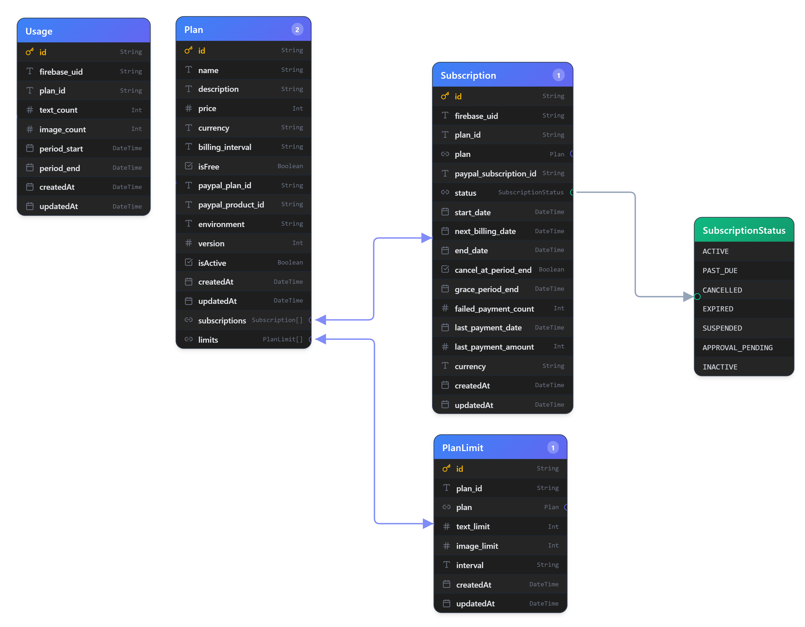

# 📘 Database Documentation (SaaS Billing System)

Updated according to the latest Prisma schema provided by the user.
Source file:

---

# 1. `Plan` — Subscription Plan Definition

## Purpose

Represents a subscription offering such as:

- Free
- Pro Monthly
- Pro Yearly

This table acts as the **source of truth for pricing, billing configuration, PayPal mapping, versioning, and plan availability**.

---

## Fields

| Field               | Type     | Required | Description                                                |
| ------------------- | -------- | -------- | ---------------------------------------------------------- |
| `id`                | String   | true     | Unique identifier for the plan (e.g. `free_v1`, `pro_v2`). |
| `name`              | String   | true     | Human-readable plan name shown in UI.                      |
| `description`       | String   | false    | Optional description used for marketing or plan details.   |
| `price`             | Int      | true     | Price stored in smallest currency unit (e.g. cents).       |
| `currency`          | String   | true     | ISO currency code (`USD`, `AUD`, `INR`).                   |
| `billing_interval`  | String   | false    | Billing cycle (`MONTH`, `YEAR`). Null for free plans.      |
| `isFree`            | Boolean  | true     | Indicates whether the plan is free.                        |
| `paypal_plan_id`    | String   | false    | External PayPal Plan ID. Must be unique.                   |
| `paypal_product_id` | String   | false    | External PayPal Product ID.                                |
| `environment`       | String   | true     | Deployment environment (`sandbox`, `live`).                |
| `version`           | Int      | true     | Plan version used for migrations and pricing evolution.    |
| `isActive`          | Boolean  | true     | Whether the plan is available for purchase/subscription.   |
| `createdAt`         | DateTime | true     | Record creation timestamp.                                 |
| `updatedAt`         | DateTime | true     | Auto-updated modification timestamp.                       |

---

## Relationships

| Relationship    | Description                                 |
| --------------- | ------------------------------------------- |
| `subscriptions` | All subscriptions associated with this plan |
| `limits`        | Usage limits assigned to this plan          |

---

## Indexes

```prisma
@@index([environment, isActive])
```

Used for:

- Fast retrieval of active plans
- Filtering plans by environment

---

## Constraints & Rules

- `paypal_plan_id` must be unique
- Free plans should not require PayPal IDs
- `billing_interval` should be null for free plans
- Multiple plan versions can exist simultaneously
- Only active plans should be shown to users

---

## Example

```json
{
  "id": "pro_v2",
  "name": "Pro",
  "description": "Best for professionals",
  "price": 499,
  "currency": "AUD",
  "billing_interval": "MONTH",
  "isFree": false,
  "paypal_plan_id": "P-XXXX",
  "paypal_product_id": "PROD-XXXX",
  "environment": "sandbox",
  "version": 2,
  "isActive": true
}
```

---

# 2. `PlanLimit` — Usage Limits per Plan

## Purpose

Defines usage quotas and rate limits for a plan.

Examples:

- 1000 text generations/month
- 100 image generations/month

---

## Fields

| Field         | Type     | Required | Description                              |
| ------------- | -------- | -------- | ---------------------------------------- |
| `id`          | String   | true     | Auto-generated unique ID using `cuid()`. |
| `plan_id`     | String   | true     | Foreign key referencing `Plan.id`.       |
| `plan`        | Relation | true     | Associated plan relation.                |
| `text_limit`  | Int      | true     | Maximum text operations allowed.         |
| `image_limit` | Int      | true     | Maximum image operations allowed.        |
| `interval`    | String   | true     | Reset cycle (`WEEK`, `MONTH`).           |
| `createdAt`   | DateTime | true     | Record creation timestamp.               |
| `updatedAt`   | DateTime | true     | Last updated timestamp.                  |

---

## Relationships

| Relationship | Description                           |
| ------------ | ------------------------------------- |
| `plan`       | Belongs to a single subscription plan |

---

## Constraints

### Unique Constraint

```prisma
@@unique([plan_id, interval])
```

Prevents duplicate limit definitions for the same plan and interval.

---

## Example

```json
{
  "plan_id": "pro_v2",
  "text_limit": 1000,
  "image_limit": 100,
  "interval": "MONTH"
}
```

---

# 3. `Subscription` — User Subscription Lifecycle

## Purpose

Tracks the complete subscription lifecycle for a user, including:

- Active subscriptions
- Billing state
- Cancellation flow
- Failed payments
- Grace periods
- Renewal dates

---

# `SubscriptionStatus` Enum

```prisma
enum SubscriptionStatus {
  ACTIVE
  PAST_DUE
  CANCELLED
  EXPIRED
  SUSPENDED
  APPROVAL_PENDING
  INACTIVE
}
```

---

## Status Definitions

| Status             | Meaning                                                  |
| ------------------ | -------------------------------------------------------- |
| `ACTIVE`           | Subscription is active and usable                        |
| `PAST_DUE`         | Payment failed but subscription may still be recoverable |
| `CANCELLED`        | Subscription manually cancelled                          |
| `EXPIRED`          | Subscription naturally expired                           |
| `SUSPENDED`        | Suspended due to billing/platform issues                 |
| `APPROVAL_PENDING` | Waiting for PayPal approval                              |
| `INACTIVE`         | Subscription exists but is not active                    |

---

## Fields

| Field                    | Type     | Required | Description                                              |
| ------------------------ | -------- | -------- | -------------------------------------------------------- |
| `id`                     | String   | true     | Unique subscription ID.                                  |
| `firebase_uid`           | String   | true     | Firebase Authentication user ID.                         |
| `plan_id`                | String   | true     | Linked plan ID.                                          |
| `plan`                   | Relation | true     | Associated plan relation.                                |
| `paypal_subscription_id` | String   | false    | External PayPal subscription ID.                         |
| `status`                 | Enum     | true     | Current subscription status.                             |
| `start_date`             | DateTime | false    | Subscription start timestamp.                            |
| `next_billing_date`      | DateTime | false    | Next billing cycle date.                                 |
| `end_date`               | DateTime | false    | Subscription end timestamp.                              |
| `cancel_at_period_end`   | Boolean  | true     | Whether cancellation is scheduled after current cycle.   |
| `grace_period_end`       | DateTime | false    | Grace period expiration timestamp after failed payments. |
| `failed_payment_count`   | Int      | true     | Number of consecutive failed payments.                   |
| `last_payment_date`      | DateTime | false    | Last successful payment timestamp.                       |
| `last_payment_amount`    | Int      | false    | Last charged amount.                                     |
| `currency`               | String   | false    | Currency used during billing.                            |
| `createdAt`              | DateTime | true     | Record creation timestamp.                               |
| `updatedAt`              | DateTime | true     | Auto-managed update timestamp.                           |

---

## Relationships

| Relationship | Description                           |
| ------------ | ------------------------------------- |
| `plan`       | Many subscriptions belong to one plan |

---

## Indexes

```prisma
@@index([firebase_uid, status])
@@index([firebase_uid, end_date])
@@index([status])
@@index([next_billing_date])
```

---

## Index Purpose

| Index                      | Usage                                         |
| -------------------------- | --------------------------------------------- |
| `(firebase_uid, status)`   | Quickly fetch active subscriptions for a user |
| `(firebase_uid, end_date)` | Retrieve subscription history                 |
| `(status)`                 | Billing reconciliation and admin filtering    |
| `(next_billing_date)`      | Renewal cron jobs and billing automation      |

---

## Constraints

- `paypal_subscription_id` must be unique
- One user can have multiple historical subscriptions
- Subscription status drives feature access

---

## Example

```json
{
  "firebase_uid": "user_123",
  "plan_id": "pro_v2",
  "status": "ACTIVE",
  "paypal_subscription_id": "I-XXXX",
  "start_date": "2026-05-01",
  "next_billing_date": "2026-06-01",
  "cancel_at_period_end": false,
  "failed_payment_count": 0
}
```

---

# 4. `Usage` — User Consumption Tracking

## Purpose

Tracks how much usage a user has consumed during a billing cycle.

Used for:

- Rate limiting
- Quota enforcement
- Billing analytics
- Usage dashboards

---

## Fields

| Field          | Type     | Required | Description                          |
| -------------- | -------- | -------- | ------------------------------------ |
| `id`           | String   | true     | Unique usage record ID.              |
| `firebase_uid` | String   | true     | Firebase user ID.                    |
| `plan_id`      | String   | true     | Associated plan ID.                  |
| `text_count`   | Int      | true     | Number of text operations consumed.  |
| `image_count`  | Int      | true     | Number of image operations consumed. |
| `period_start` | DateTime | true     | Start of usage window.               |
| `period_end`   | DateTime | true     | End of usage window.                 |
| `createdAt`    | DateTime | true     | Record creation timestamp.           |
| `updatedAt`    | DateTime | true     | Last modification timestamp.         |

---

## Constraints

### Unique Constraint

```prisma
@@unique([firebase_uid, plan_id, period_start])
```

Ensures only one usage record exists per user, plan, and billing cycle.

---

## Indexes

```prisma
@@index([firebase_uid])
```

Used for:

- Fetching user usage quickly
- Dashboard analytics
- Rate limit checks

---

## Example

```json
{
  "firebase_uid": "user_123",
  "plan_id": "pro_v2",
  "text_count": 120,
  "image_count": 10,
  "period_start": "2026-05-01",
  "period_end": "2026-06-01"
}
```

---

# System Architecture Flow

## Subscription Lifecycle

```text
Plan
   ↓
PlanLimit
   ↓
Subscription
   ↓
Usage
```

---

# System Flow Explanation

## 1. `Plan`

Defines:

- Pricing
- Billing interval
- Environment
- Availability
- PayPal mappings

---

## 2. `PlanLimit`

Defines quotas such as:

- Text generation limits
- Image generation limits
- Reset intervals

---

## 3. `Subscription`

Tracks:

- Which user owns which plan
- Billing state
- Renewal dates
- Failed payments
- Cancellation lifecycle

---

## 4. `Usage`

Tracks actual consumption during a billing window.

Used for:

- Enforcing limits
- Analytics
- Feature gating

---

# Key Design Decisions

| Decision               | Reason                                   |
| ---------------------- | ---------------------------------------- |
| Versioned plans        | Safe pricing migrations                  |
| Environment separation | Prevent sandbox/live conflicts           |
| External PayPal IDs    | Decouples internal billing logic         |
| Dedicated Usage table  | Enables scalable quota enforcement       |
| Status enum            | Centralized billing lifecycle management |
| Grace period support   | Better failed-payment recovery           |
| Indexed billing dates  | Efficient cron automation                |

---

# Recommended Future Improvements

## Suggested Enhancements

### Add Soft Deletes

```prisma
deletedAt DateTime?
```

Useful for archival without permanent deletion.

---

### Add Feature Flags per Plan

Example:

```prisma
features Json?
```

Allows enabling/disabling premium capabilities.

---

### Add Audit Logs

Track:

- Subscription upgrades
- Downgrades
- Payment events
- Refunds

---

### Normalize Billing Intervals

Replace string intervals with enums:

```prisma
enum BillingInterval {
  WEEK
  MONTH
  YEAR
}
```

---

### Add Usage Types

Future-proof for additional AI features:

- audio_count
- video_count
- storage_usage

---

# ERD Overview


